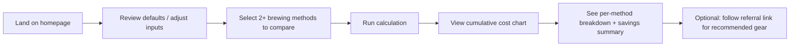

# The Brewdown: Coffee Cost Comparison Calculator

**Version:** 0.8 (draft)  
**Status:** Stack, analytics, and visual direction (FoxDoo-inspired) confirmed; other items in §12 still open  
**Last updated:** 2026-06-15

---

## 1. Overview

### 1.1 Purpose

**The Brewdown** is a static, browser-only website that helps cost-conscious coffee drinkers compare the **total cost of brewing at home** for two or more coffee habits over time. The name is a play on "the lowdown": straight talk on what home coffee actually costs.

**Terminology (v1):** Use **total cost of brewing at home** (or shortened **brewing cost**) in user-facing copy. Each comparison line includes upfront machine cost, home ingredients, and that method’s café spend. Avoid “TCO,” “total cost of ownership,” and “ownership.” **Copy rule:** Do not mention a fixed year count (e.g. “5 years”) in marketing, eyebrows, or meta text — only in **calculated results** (savings callouts, crossover year, breakdown totals). The chart spans **60 months** internally; that horizon is an implementation constant, not a headline promise.

**Hook 1 — lines cross:** On the chart, cumulative cost lines **cross**. Pre-packaged pods often start cheaper (low machine cost) but climb faster (high per-cup cost), while bulk methods like bean-to-cup start higher (machine purchased upfront) but overtake pods as daily home-brew savings accumulate.

**Hook 2 — fewer café visits:** Better home coffee means **fewer coffee shop drinks**. Each comparison method carries its own expected café frequency — upgrading from pods to bean-to-cup isn’t just cheaper per cup at home; it also **replaces shop visits**, steepening savings. Defaults reflect this (e.g. bean-to-cup: 4 shop drinks/month vs pods: 12/month).

### 1.2 Target audience

- Households and individuals deciding how to brew at home
- **Not** hobbyist/manual-brew enthusiasts; avoid jargon-heavy UX
- Motivated by savings and simplicity, not cupping scores or grind theory

### 1.3 Business model (v1)

| Channel | v1 scope |
|--------|----------|
| Referral / affiliate links | **Yes** — contextual product recommendations tied to comparison results |
| Display ads | **No** — deferred to a later version |

### 1.4 Technical constraints

- **No application backend** — HTML, CSS, and client-side JavaScript only
- **Astro** with **Islands architecture** — static HTML for content pages; interactive calculator/chart as hydrated client islands only
- **Static output** (`output: 'static'`) — no SSR, API routes, or serverless functions
- **Hosted on Vercel** — static deployment from the Astro build output
- All calculations run in the browser; no user accounts or stored data in v1

---

## 2. Site structure

### 2.1 Pages (v1)

| Page | Route (proposed) | Rendering | Purpose |
|------|------------------|-----------|---------|
| Landing / calculator | `/` | Static shell + **client islands** | Main calculator, chart, referral CTAs |
| About | `/about` | Static (no islands) | What The Brewdown is, how costs are estimated, disclaimer |
| Privacy & disclosures | `/privacy` | Static (no islands) | Privacy policy, affiliate disclosure, cookie/analytics note |

### 2.2 Out of scope for v1

- Blog or guide content
- User accounts, saved scenarios, shareable URLs with encoded state (optional future)
- Display advertising
- Multi-currency support (see [BACKLOG.md](./BACKLOG.md))
- Metric units as default (imperial first; metric toggle planned for later)

---

## 3. User journey



1. User arrives on landing page with **sensible defaults** pre-filled.
2. User adjusts consumption, ingredient costs, machine costs, and **per-method** coffee-shop frequency as needed.
3. User selects **two or more** brewing methods from the comparison set.
4. User triggers calculation (explicit button and/or live update — see §7.3).
5. Results show a **cumulative brewing cost chart** (home + shop spend per method); users see lines **cross** when a higher-upfront method becomes cheaper, amplified by lower café spend on better methods.
6. Contextual **referral links** appear near results for machines/consumables relevant to the winning or selected methods.

---

## 4. Brewing methods & comparison model

### 4.1 Methods to compare (v1 — confirmed)

| ID | Display name | Group | Ingredient model | Notes |
|----|--------------|-------|------------------|-------|
| `pods` | Pre-packaged pods | One-touch convenience | Per pod/capsule | Pod style preset (K-Cup / Nespresso) prefills machine and pod cost |
| `bean_to_cup` | Bean-to-cup (super-automatic) | One-touch convenience | Bulk (grams/lb) | Higher machine cost; lower per-cup ingredient cost; **fewest default shop drinks** |
| `bulk_brew` | Drip, press, or pour-over | Bulk home brewing | Bulk (grams/lb) | Gear preset (drip / French press / pour-over) prefills machine, ingredient, and shop defaults |
| `manual_espresso` | Manual espresso | Espresso | Bulk (grams/lb) | Espresso machine + grinder (machine cost may include grinder); ~18g per double shot |

**Pod method (`pods`) detail:** K-Cup and Nespresso are not separate comparison lines. One `pods` method covers both; the user selects a **pod style preset** (K-Cup or Nespresso) to populate defaults, then can override cost per pod/capsule and machine cost.

**Bulk brew method (`bulk_brew`) detail:** Drip, French press, and pour-over are not separate comparison lines. One `bulk_brew` method covers all three; the user selects a **gear preset** to populate machine, ingredient, and shop defaults. Grinder toggle deferred post-v1.

**Method selector groups:** One-touch convenience (`pods`, `bean_to_cup`), Bulk home brewing (`bulk_brew`), Espresso (`manual_espresso`).

**Manual espresso note:** “Cups per day” for espresso drinkers may mean shots/drinks; grams-per-cup default reflects a typical double shot (~18g). Copy should say “drinks” where helpful without forcing a separate input in v1.

**Coffee shop spend — per method, not global:** There is no standalone `coffee_shop` comparison method. Every home method includes **coffee shop drinks per week or per month** representing residual café visits *in addition to* home `cups_per_day`. Better methods default to fewer shop drinks. **Brewing cost** for each line = upfront machine + home ongoing + **that method’s** shop ongoing.

**Optional café-only baseline (v1):** A preset or toggle *“Café only (no home brewing)”* may add a comparison line with `machine_cost = 0`, home `cups_per_day` treated as 0, and shop drinks derived from total consumption (see §5.4). Not a separate method ID in the config.

### 4.2 What brewing cost includes (v1)

For each home brewing method:

| Cost component | Included in v1? | Notes |
|----------------|-----------------|-------|
| Coffee ingredients (beans/grounds/pods/capsules) | **Yes** | Home brewing; accrues daily; drives part of line **slope** |
| Coffee shop drinks | **Yes** | **Per method** — accrues daily; drives remaining slope; defaults lower on better home methods |
| Machine upfront cost | **Yes** | **One-time lump sum at year 0** — not amortized; sets the line **starting point** |
| Filters, descaling, misc consumables | **Optional / TBD** | Accrue daily or annually (converted to daily); add to slope |
| Electricity / water | **No** | Exclude in v1 unless owner requests |
| Milk, syrups, tips (shop drinks) | **TBD** | Base drink price only (global), or add-on field later |
| Labor / time | **No** | Not monetized |

**Design intent:** No machine amortization. A $800 bean-to-cup machine adds **$800 on day one**, not spread across years. The chart shows when cumulative savings (home **and** reduced café spend) outweigh that upfront gap — the **crossover** is hook 1. Hook 2 is visible in the breakdown: bean-to-cup’s shop spend line item is much smaller than pods’.

### 4.3 Core formulas (conceptual)

**Daily ongoing cost (method *m*):**

```
daily_ongoing[m] = home_daily[m] + shop_daily[m] + consumables_cost_per_day[m]
```

**Daily home brewing cost (method *m*):**

```
home_daily[m] = ingredient_cost_per_day[m]
```

**Daily ingredient cost (method *m*):**

```
ingredient_cost_per_day[m] = cups_per_day × grams_per_cup[m] × (cost_per_unit_coffee[m] / units_per_gram)
```

For the `pods` method, `grams_per_cup` is replaced by `pods_per_cup` (typically 1) and `cost_per_pod`.

**Per-method coffee shop daily cost:**

Each method *m* has its own shop drink count. Period is **per week** or **per month** (user toggle, can be shared UI control or per-method):

```
shop_daily[m] = (shop_drinks_per_week[m] × price_per_drink) / 7
```
—or—when period is monthly:

```
shop_daily[m] = (shop_drinks_per_month[m] × price_per_drink) / (365 / 12)
```

`price_per_drink` is a **global** input (same café assumed for all methods). Only the **frequency** of visits varies per method.

**Café-only baseline** (optional comparison line):

```
home_daily = 0
machine_cost = 0
shop_drinks_per_month = cups_per_day × (365 / 12)   // all consumption at café
```

**Cumulative brewing cost at time *t* days (method *m*):**

```
brewing_cost[m](t) = machine_cost[m] + daily_ongoing[m] × t
```

- `machine_cost[m] = 0` for café-only baseline.
- At **t = 0**, home methods start at their machine price (not $0). Café-only starts at $0.

**Cumulative brewing cost at year *Y*:**

```
brewing_cost[m](Y) = machine_cost[m] + daily_ongoing[m] × 365 × Y
```

**Cost per cup equivalent (at year *Y*, method *m*):**

```
total_drinks[m] = (cups_per_day × 365 × Y) + shop_drinks_in_period[m] × (Y / period_years)
cost_per_drink_equivalent[m](Y) = brewing_cost[m](Y) / total_drinks[m]
```

(At very small *Y*, hide or guard per-cup display until Y ≥ 1 month.)

**Crossover year between methods *A* and *B* (for chart marker):**

When `machine_cost[A] + daily_ongoing[A] × 365 × Y = machine_cost[B] + daily_ongoing[B] × 365 × Y`:

```
crossover_Y = (machine_cost[B] - machine_cost[A]) / (365 × (daily_ongoing[A] - daily_ongoing[B]))
```

Only show marker when `crossover_Y` is within the chart horizon (0–60 months) and the denominator is non-zero.

---

## 5. Inputs & defaults

### 5.1 Global inputs

| Input | Type | Default (proposed) | Validation |
|-------|------|-------------------|------------|
| Cups of coffee per day (home) | Number (0.5 step) | `2` | > 0; home-brewed cups, same across methods |
| Average price per shop drink | Currency | `$5.00` | Global; base drink, no milk/syrup upsell in v1 unless added |
| Shop drink period | Toggle | **per month** | **Per week** or **per month** — applies to all methods’ shop-drink inputs |
| Comparison chart span | Fixed in v1 | **60 months** | Internal constant; not advertised in user-facing copy |
| Methods to compare | Multi-select (≥ 2) | `pods`, `bean_to_cup` | Min 2 selected |
| Include café-only baseline | Checkbox | `false` | Optional line: all `cups_per_day` purchased at café, no machine |

### 5.2 Per-method inputs

Each selected method exposes a **collapsible section** or column with method-specific fields.

| Input | Applies to | Type | Default (proposed) | Notes |
|-------|------------|------|-------------------|-------|
| Pod style (defaults only) | `pods` | Toggle | `kcup` | `kcup` or `nespresso` — prefills cost per pod & machine cost; user can override |
| Gear preset (defaults only) | `bulk_brew` | Toggle | `drip` | `drip`, `french_press`, or `pour_over` — prefills machine, ingredient, shop drinks, and consumables |
| Grams of coffee per cup | Bulk methods (`bulk_brew`, `manual_espresso`, `bean_to_cup`) | Number | Method-specific (e.g. 15g; 18g for espresso) | Link to “typical range” hint |
| Cost of coffee ingredients | All home methods | Currency | Method-specific | Bulk: $/lb beans; `pods`: $/pod or $/capsule |
| Machine cost | All home methods | Currency | Method-specific | One-time purchase at t=0; manual espresso may bundle grinder into this field in v1 |
| Coffee shop drinks | **Each method** | Number | Method-specific (see §5.4) | Uses global period toggle (week/month); **key hook 2 input** |
| Pods/capsules per cup | `pods` | Number | `1` | |
| Annual consumables | Optional | Currency/year | `0` or method default | Drip filters, pour-over papers, descaling; converted to daily in formula |

**UX note:** When the user changes shop drinks on one method, show helper copy: *“Better home setups often mean fewer café trips. Adjust if needed.”* Optionally link “apply suggested defaults” per method tier.

### 5.4 Default value philosophy

- Defaults should tell a **credible crossover story** (hook 1): pod line starts lower (cheap machine) but bean-to-cup crosses below during the comparison period.
- Defaults should tell a **credible café-reduction story** (hook 2): methods that produce better home coffee assume **fewer shop drinks**.

**Proposed default shop drinks (per month):**

| Method / preset | Shop drinks/month | Rationale |
|-----------------|-------------------|-----------|
| `pods` (K-Cup or Nespresso) | 12 | Convenient but uninspiring; still hit the café often |
| `bulk_brew` — drip | 8 | Decent weekday coffee; occasional café treat |
| `bulk_brew` — French press | 10 | Good flavor but hassle; café for convenience |
| `bulk_brew` — pour-over | 8 | Weekend ritual; weekday café runs |
| `manual_espresso` | 5 | Café-quality shots at home; rare shop visits |
| `bean_to_cup` | 4 | One-touch café drinks; minimal shop need |

- Use **USD** and **imperial** units (oz/lb) in labels; store internally in consistent units (grams + USD) for math.
- Defaults must be **editable**; document assumptions on About page.

**[OPEN]** Exact home-ingredient and machine default numbers — to be confirmed or sourced before launch.

---

## 6. Outputs & charting

### 6.1 Primary chart

- **Library:** [LayerChart](https://www.layerchart.com) (Svelte, composable cartesian charts)
- **Type:** Multi-series line chart (`Spline` or `Line` marks)
- **X-axis:** Time — 60 monthly points (years 0–5 on axis labels; implementation detail)
- **Y-axis:** **Cumulative brewing cost (USD)** — machine upfront + all ongoing costs to date
- **Series:** One line per selected home method (+ optional café-only baseline)
- **Y-intercept:** Each home method’s line begins at **machine cost** at year 0 (not at $0). Café-only baseline starts at $0.
- **Hook 1 — crossover highlight:** LayerChart annotation or `Point` + tooltip at crossover month/year; callout copy such as: *“Bean-to-cup becomes cheaper than pods after ~2.3 years.”*
- **Hook 2 — shop savings in breakdown:** Summary cards and table split **home ongoing** vs **shop ongoing** so users see café savings from upgrading (not just cheaper beans)
- **Interaction:** Tooltip on hover/tap showing method, date, cumulative brewing cost; legend toggling series optional in v1

### 6.2 Summary cards (below or beside chart)

For each method at the **end of the comparison period** (month 60):

- Total brewing cost
- Upfront machine cost (if any)
- Home ongoing (ingredients + consumables) over the period
- **Shop ongoing** (per-method café spend) over the period
- Cost per drink equivalent (home + shop)
- Rank (1 = cheapest)

**Savings callout (hero insight):**

> “Switching from [most expensive] to [cheapest] saves about **$X** over the comparison period (**$Y** per year) — including **$Z** less at coffee shops.”

If lines cross on the chart, prefer crossover copy as the primary hero:

> “[Cheaper method] pays for its higher machine cost after **~W years**, then saves **$X** by the end of the comparison — and you’d buy **N** fewer café drinks per month.”

### 6.3 Secondary breakdown (optional v1)

Simple table:

| Method | Machine (upfront) | Home (total) | Shop (total) | Total brewing cost | $/drink equiv. |
|--------|-------------------|------------|------------|-----------|----------------|

---

## 7. UI / UX requirements

### 7.1 Design principles

- **Warm editorial layout** — inspired by [FoxDoo](https://foxdoo.ca/): cream paper backgrounds, generous whitespace, soft card shadows, rounded corners, clear section hierarchy
- **Simple illustrated accents** — flat 2D graphics with thick dark outlines and muted fills, in the spirit of the [architect-calculator app icon](https://foxdoo.ca/assets/architect-calculator/app-icon.png) (adapted to coffee: mug, beans, dripper — not literal FoxDoo assets)
- **Svelte UX** for calculator controls, cards, and layout primitives, themed with The Brewdown tokens (§7.5)
- **Cost-conscious tone** — practical copy, no pretentious coffee culture
- **Mobile-responsive** — single column on small screens; chart remains readable
- **Accessible** — semantic HTML, keyboard-navigable controls, sufficient contrast (WCAG 2.1 AA target on token colors)

### 7.2 Layout (landing page)

FoxDoo-style patterns adapted for the calculator:

- **Page shell:** warm `--paper` background; max-width container with `--gutter` padding
- **Header:** minimal sticky nav — wordmark left, About / Privacy right; thin bottom border (`--line`)
- **Hero band:** display headline + one-line value prop; optional **hero illustration** (outlined coffee tools cluster) on desktop right, hidden or simplified on mobile
- **Eyebrow labels:** small mono caps above sections — FoxDoo section-label pattern
- **Main grid:** two-column on desktop (inputs left, results right); stacks on mobile
- **Cards:** `--paper-2` or white surface on `--paper`, `--r-lg` radius, `--shadow-md`; savings callout uses `--brand-soft` tint
- **Footer:** muted `--ink-3` text, affiliate disclosure, ©

```
┌─────────────────────────────────────────────────────────┐
│  Header: The Brewdown wordmark, nav (About, Privacy)    │
├─────────────────────────────────────────────────────────┤
│  Hero: headline + value prop          [illustration]  │
│  eyebrow: CALCULATOR · HOME BREWING COST                │
├──────────────────────────┬──────────────────────────────┤
│  Input panel (card)      │  Results panel (card)        │
│  - Global inputs         │  - Savings callout (brand)   │
│  - Method multi-select   │  - Line chart (LayerChart)   │
│  - Per-method fields     │  - Summary stat chips        │
│                          │  - Breakdown table           │
│                          │  - Referral CTAs             │
├──────────────────────────┴──────────────────────────────┤
│  Footer: affiliate disclosure, ©                        │
└─────────────────────────────────────────────────────────┘
```

On mobile: hero illustration above or below headline; inputs stack above results.

### 7.3 Interaction model

**[OPEN]** Prefer:

- **A)** Live recalculation on input change (debounced), or  
- **B)** Explicit “Calculate” / “Compare” button only

Recommendation: **debounced live update** for responsiveness, with chart animation throttled.

### 7.4 Referral link placement (v1)

- No display ads in v1
- After results render, show **contextual** affiliate blocks:
  - Bean-to-cup machine when `bean_to_cup` is selected or wins
  - Keurig / Nespresso machine or pods when `pods` is in comparison (match pod style preset if set)
  - Espresso machine / grinder when `manual_espresso` is selected
  - Pour-over dripper / kettle when `bulk_brew` gear preset is `pour_over`
  - Generic bulk coffee links for `bulk_brew` and other bulk methods
- Clear label: **“Affiliate link”** or “We may earn a commission”
- Links open in new tab with `rel="noopener sponsored"`

**[OPEN]** Affiliate programs (Amazon Associates, specific brands, etc.) and whether links are hardcoded or config-driven JSON.

### 7.5 Visual design system (FoxDoo-inspired)

**Reference:** [FoxDoo](https://foxdoo.ca/) layout, typography, and warm palette. Tokens are defined in [`design/tokens.css`](design/tokens.css) and mapped into Tailwind in `tailwind.config.mjs` at scaffold time.

| Token | Hex | Use |
|-------|-----|-----|
| `--ink` | `#1d1814` | Headlines, body text, chart crossover marker |
| `--ink-2` | `#4a3f33` | Secondary text |
| `--ink-3` | `#7a6d5e` | Captions, footer, axis labels |
| `--paper` | `#fbf6ee` | Page background |
| `--paper-2` | `#f3e9d7` | Card surfaces, input backgrounds |
| `--paper-3` | `#ece0c8` | Subtle borders, zebra rows |
| `--brand` | `#e8743f` | Primary CTA, hero accent, chart series 1 |
| `--brand-soft` | `#fbe6d6` | Savings callout card tint |
| `--sage` | `#6b8e7f` | Secondary accent, chart series 2 |
| `--teal` | `#5a8f8a` | Chart series 4, illustration fills |
| `--line` | `rgba(29,24,20,.12)` | Dividers, grid lines |

**Typography:**

| Role | Font | Fallback |
|------|------|----------|
| Display (H1, hero) | [Cabinet Grotesk](https://www.fontshare.com/fonts/cabinet-grotesk) | Mona Sans, system-ui |
| Body (UI, prose) | [General Sans](https://www.fontshare.com/fonts/general-sans) | Hanken Grotesk, system-ui |
| Mono (eyebrows, stats) | [JetBrains Mono](https://www.jetbrains.com/lp/mono/) | ui-monospace |

Load via Fontshare / Google Fonts CDN in `BaseLayout.astro` (same pairing as FoxDoo).

**Components (Svelte UX + tokens):**

- Inputs: `--paper-2` fill, `--line-strong` border, `--r-sm` radius, `--brand` focus ring
- Buttons / CTAs: `--brand` fill, `--brand-ink` text; secondary = outline with `--ink`
- Cards: `--shadow-md`, `--r-lg`, 1px `--line` border optional
- Summary stat chips: FoxDoo-style metric pills — large number, small mono label below
- Breakdown table: FoxDoo compare-table feel — light header row on `--paper-3`, row dividers `--line`

**LayerChart theming:**

- Grid: `--chart-grid` (`--line`)
- Axis labels: `--ink-3`, body font at 12–13px
- Series colors: `--chart-1` … `--chart-6` from tokens (brand, sage, warm browns, teal)
- Tooltip: cream card (`--paper`), `--shadow-md`, `--r-md`
- Crossover point: `--chart-crossover` with `--brand-soft` callout bubble

**Texture (optional v1):** subtle paper grain on `--paper` background via CSS `background-image` noise overlay at ~3% opacity — matches illustrated icon tactile feel without hurting performance.

### 7.6 Illustration & brand assets

**Style rules** (from [app icon reference](https://foxdoo.ca/assets/architect-calculator/app-icon.png)):

- Flat 2D, no gradients inside objects; thick uniform `--illustration-outline` strokes
- Fills: `--brand` / `--teal` / `--illustration-cream` on `--illustration-bg` ochre panel optional for hero badge
- Soft drop shadow behind illustration group only (`--shadow-lg`)
- No photorealism, no stock photos in v1

**v1 assets to produce:**

| Asset | Path | Purpose |
|-------|------|---------|
| Favicon | `public/favicon.svg` | Simplified mug or bean icon, outlined |
| Hero illustration | `public/illustrations/hero-coffee.svg` | Mug + beans + dripper cluster for landing hero |
| OG image | `public/og.png` | 1200×630 — headline + small illustration on `--paper` |

Illustrations are **original The Brewdown coffee-themed art** in the same style as the reference icon; do not reuse FoxDoo trademark assets.

---

## 8. Content & legal

### 8.1 About page

- Mission: help households save on daily coffee without complexity
- How estimates work (upfront machine + home daily + **per-method shop spend**, 60-month chart span, no amortization, what’s excluded)
- Explain hook 2: shop drink defaults assume better home methods reduce café visits; users should adjust to match their habits
- “Illustrative only — not financial advice”

### 8.2 Privacy & disclosures page

- No personal data collected or stored by The Brewdown in v1 (calculator runs entirely in the browser)
- **Vercel Web Analytics** (Hobby, free) — anonymized page views, visitors, referrers, and device/geo breakdown; no cookies; no cross-day visitor tracking
- No cookie banner required for Vercel Web Analytics alone
- Describe what Vercel collects on behalf of the site and link to [Vercel’s privacy documentation](https://vercel.com/docs/analytics/privacy-policy)
- Affiliate disclosure (FTC-compliant)

---

## 9. Technical specification

### 9.1 Stack

| Layer | Choice |
|-------|--------|
| Site framework | **Astro 5** — static site generation with Islands |
| Island UI | **Svelte 5** components for interactive regions (calculator, chart, results) |
| Component library | **[Svelte UX](https://svelte-ux.techniq.dev)** (`svelte-ux`) — inputs, cards, toggles, layout |
| Charts | **[LayerChart](https://www.layerchart.com)** (`layerchart`) — multi-series line chart in `CostChart` island |
| Markup | Semantic HTML5 (Astro `.astro` pages + layouts) |
| Style | **Tailwind CSS** via `@astrojs/tailwind` + [`design/tokens.css`](design/tokens.css) (FoxDoo-inspired palette) |
| Logic | Svelte islands on `/`; shared calc/config modules imported by islands |
| Analytics | **Vercel Web Analytics** (`@vercel/analytics`) — Hobby free tier |
| Hosting | **Vercel** — static deploy of `dist/` from `astro build` |
| Build | Astro CLI (`astro dev` / `astro build`); Vite under the hood |

**Key npm packages:** `astro`, `@astrojs/svelte`, `@astrojs/tailwind`, `svelte`, `svelte-ux`, `layerchart`, `@vercel/analytics`

### 9.2 Astro Islands architecture

Astro ships **zero client JS by default**. Only marked islands hydrate in the browser.

**Shared layout (static):**

- `src/layouts/BaseLayout.astro` — `<html>`, meta, global styles, header nav, footer; includes `<Analytics />` from `@vercel/analytics/astro`
- Header links to `/`, `/about`, `/privacy`; affiliate disclosure in footer

**Landing page (`src/pages/index.astro`):**

| Region | Implementation | Hydration |
|--------|----------------|-----------|
| Hero, page chrome | Astro markup in `index.astro` | None (static HTML) |
| Calculator + results | `<BrewdownApp client:load />` | On page load |
| Cumulative cost chart | Inside `BrewdownApp` — `CostChart.svelte` using LayerChart | With parent island |

Use a **single parent island** (`BrewdownApp`) so calculator state, Svelte UX form controls, LayerChart data, and results stay in sync without cross-island prop drilling.

**Svelte UX** (inside `BrewdownApp`):

- Global inputs: `Input`, `Select` or `SegmentedControl`, `Checkbox`
- Per-method sections: `Accordion` or `Card` with collapsible fields
- Results: `Card` for summary metrics and savings callout
- Referral blocks: `Card` + styled links

**LayerChart** (inside `CostChart.svelte`):

- `Chart` container with `Axis`, `Grid`, `Spline`/`Line` series, `Tooltip`, `Legend`
- Data from `brewing-cost.ts` — monthly cumulative brewing cost points per method
- Crossover marker via annotation layer or highlighted `Point`

Use **`client:load`** on `BrewdownApp` so inputs and chart are interactive immediately. LayerChart loads with the parent island (no separate chart island in v1).

**Content pages (fully static):**

- `src/pages/about.astro` — no `client:*` directives
- `src/pages/privacy.astro` — no `client:*` directives

**Shared modules (no hydration):**

- `src/data/methods.ts` — method definitions, defaults, field visibility
- `src/lib/brewing-cost.ts` — pure calculation functions (imported by Svelte islands)
- `src/data/affiliates.ts` — referral link config (if not hardcoded)

**Island components:**

- `src/components/BrewdownApp.svelte` — parent island: Svelte UX forms, results, embeds `CostChart`
- `src/components/CostChart.svelte` — LayerChart multi-series line chart + crossover marker

### 9.3 Data architecture

- **Method definitions** in `src/data/methods.ts` (or JSON imported at build time): id, label, default grams, default machine cost, default ingredient cost, **default shop drinks**, field visibility
- **No API** — all defaults ship with the static bundle at build time
- **No localStorage** required in v1; optional “remember my inputs” later

### 9.4 Performance

- Target Lighthouse performance ≥ 90 on mobile
- `/about` and `/privacy` ship **no island JS** — Astro static HTML only
- Svelte UX + LayerChart bundles load **only on `/`** (via `BrewdownApp` island)
- Total island JS budget goal: < 150 KB gzipped (excluding LayerChart / D3); monitor bundle in CI and trim if over
- Vercel serves pre-built assets from `dist/` with CDN caching; no server runtime

### 9.5 Deployment (Vercel)

| Setting | Value |
|---------|--------|
| Framework preset | Astro |
| Build command | `npm run build` (runs `astro build`) |
| Output directory | `dist` |
| Install command | `npm install` |
| Node version | 20 LTS (or current Astro minimum) |

- Connect the Git repo to Vercel; production deploys on push to `main`
- Preview deployments on pull requests
- No `vercel.json` required for a standard Astro static project unless custom headers/redirects are added later
- Environment variables: none required for v1 (Vercel Web Analytics needs no API keys when enabled on the project)

### 9.6 Analytics (Vercel Web Analytics)

| Setting | Value |
|---------|--------|
| Product | Vercel Web Analytics (included on Hobby plan) |
| Package | `@vercel/analytics` |
| Integration | `<Analytics />` in `BaseLayout.astro` (all pages) |
| Vercel dashboard | Enable **Web Analytics** on The Brewdown project |
| Monthly limit | 50,000 events (page views count as events) |
| Data retention | 1 month (Hobby) |
| Custom events | **Not in v1** — Hobby tier does not support custom events (e.g. `calculation_run`) |

**v1 scope:** Traffic and engagement only — visitors, page views, bounce rate, top pages, referrers, country, OS, browser. Referral click counts come from **affiliate program dashboards**, not Vercel Analytics.

**Future:** Upgrade to Vercel Pro (or a third-party tool) if custom events or UTM campaign tracking are needed.

### 9.7 SEO (basics)

- Title: “The Brewdown: Coffee Cost Calculator, Compare Pods, Drip, Pour-Over, Espresso & Bean-to-Cup”
- Meta description focused on long-term home-brewing savings (no fixed year count in copy)
- Structured data: `WebApplication` or `FAQPage` (optional)

---

## 10. Monetization roadmap

### 10.1 v1 — Referrals only

- Contextual affiliate CTAs in results
- Full disclosure on Privacy page and near links

### 10.2 Future — Display ads

- Reserve layout regions (sidebar, between hero and calculator, footer banner) without implementing in v1
- Document ad network preference when activated (e.g. AdSense)

---

## 11. Success metrics

| Metric | Tool |
|--------|------|
| Unique visitors & page views | Vercel Web Analytics |
| Bounce rate & top pages | Vercel Web Analytics |
| Referrers (traffic sources) | Vercel Web Analytics |
| Calculator interactions | Not tracked in v1 (no custom events on Hobby); use `/` page views and bounce rate as proxies |
| Referral clicks | Affiliate program dashboard (Amazon Associates, etc.) |

---

## 12. Open questions (must resolve before implementation)

Please answer these to finalize the spec:

1. ~~**Custom brew methods**~~ — **Resolved.** v1 methods: `pods`, `bean_to_cup`, `bulk_brew`, `manual_espresso`. Drip, French press, and pour-over are gear presets on `bulk_brew`; K-Cup and Nespresso are pod style presets on `pods`.
2. ~~**Brewing cost model**~~ — **Resolved.** Machine cost upfront at t=0; no amortization; chart crossover is hook 1. User-facing term: **total cost of brewing at home**.
3. ~~**Coffee shop modeling**~~ — **Resolved.** Shop drinks are **per comparison method** (week/month); global `price_per_drink`; optional café-only baseline checkbox. No standalone `coffee_shop` method.
4. ~~**Stack & hosting**~~ — **Resolved.** Astro 5 with Svelte client islands; Tailwind CSS; Svelte UX + LayerChart; static output; deploy to Vercel.
5. ~~**Analytics**~~ — **Resolved.** Vercel Web Analytics on Hobby (free); `@vercel/analytics` in site layout; no custom events in v1.
6. ~~**Visual direction**~~ — **Resolved.** FoxDoo-inspired warm editorial layout; illustrated accents per app-icon style; tokens in `design/tokens.css`.
7. **Consumables:** Include annual filter/descaling costs in v1, or ship without them?
8. **Default dollar amounts:** Provide preferred defaults per method, or should implementation use researched illustrative values?
9. **Affiliate partners:** Which programs/links for v1 (Amazon, specific machines, coffee subscriptions)?
10. **Live vs button calculate:** Debounced live update or explicit button?
11. ~~**Branding**~~ — **Resolved.** Product name **“The Brewdown”** (play on “the lowdown”); tagline/domain TBD.
12. **Metric toggle:** Defer entirely to post-v1, or include hidden/developer-only conversion?
13. **Manual espresso:** Should grinder cost be a separate input or rolled into machine cost for v1?
14. **Café-only baseline:** Include checkbox in v1 or defer?

---

## 13. Acceptance criteria (v1)

- [ ] User can select ≥ 2 methods and see a cumulative **brewing cost** chart
- [ ] Home-brew lines start at machine upfront cost at year 0 (not amortized)
- [ ] Changing cups/day and ingredient costs updates brewing cost correctly in the browser
- [ ] Default `pods` vs `bean_to_cup` scenario shows lines **crossing** on the chart (hook 1; crossover ~year 2–3 in default scenario)
- [ ] Each method has editable shop drinks (week/month); defaults show bean-to-cup **lower** than pods (hook 2)
- [ ] Summary breakdown separates **home** vs **shop** spend per method
- [ ] Crossover year/month is labeled on the chart when applicable
- [ ] Referral blocks visible with affiliate disclosure; no display ads
- [ ] About and Privacy pages linked from header/footer
- [ ] Responsive layout works on mobile and desktop
- [ ] Site builds with `astro build` (`output: 'static'`) and deploys to **Vercel** with no server runtime
- [ ] `/about` and `/privacy` render as static HTML with no client islands
- [ ] Calculator and chart run as a single Astro client island (`BrewdownApp`) on `/` only, using Svelte UX and LayerChart
- [ ] Vercel Web Analytics enabled; Privacy page discloses anonymized analytics; no cookie banner for analytics alone
- [ ] Visual design follows §7.5 tokens (warm paper palette, FoxDoo-style cards/typography); hero or favicon uses outlined illustration style (§7.6)

---

## Appendix A — Example default scenario (illustrative)

*Numbers below are placeholders until §12.8 is answered.*

| Input | Pods (K-Cup preset) | Bean-to-cup |
|-------|---------------------|-------------|
| Cups/day (home) | 2 | 2 |
| Ingredient cost | $0.65 / pod | $12 / lb beans |
| Pods or grams per cup | 1 pod | 15g |
| Machine cost | $120 | $800 |
| Shop drinks/month | 12 | 4 |
| Price per shop drink (global) | $5.00 | $5.00 |

**Expected narrative (hook 1):** At year 0, bean-to-cup brewing cost starts at **$800** vs pods at **$120**. Bean-to-cup has a flatter slope (cheaper home coffee). Lines **cross** around year 2–3.

**Expected narrative (hook 2):** Bean-to-cup assumes **8 fewer shop drinks/month** than pods → **$40/month** less café spend → **$2,400** less shop spend over the 60-month comparison, on top of home-brew savings. Copy and breakdown table make this visible.

### Appendix B — Method ingredient model (quick reference)

| Method | Cost input unit | Machine? | Default shop drinks/mo |
|--------|-----------------|----------|------------------------|
| `pods` | $/pod or $/capsule | Yes | 12 |
| `bean_to_cup` | $/lb | Yes (highest) | 4 |
| `bulk_brew` | $/lb | Yes | 8 (drip preset); 10 (French press); 8 (pour-over) |
| `manual_espresso` | $/lb | Yes (higher) | 5 |

**Bulk gear presets (`bulk_brew`):**

| Preset | Machine | $/lb | Shop/mo |
|--------|---------|------|---------|
| drip | $45 | $10 | 8 |
| french_press | $28 | $11 | 10 |
| pour_over | $55 | $12 | 8 |

**Pod style presets (`pods`):**

| Preset | Machine | $/pod | Shop/mo |
|--------|---------|-------|---------|
| kcup | $120 | $0.65 | 12 |
| nespresso | $180 | $0.75 | 12 |

---

*End of specification.*
